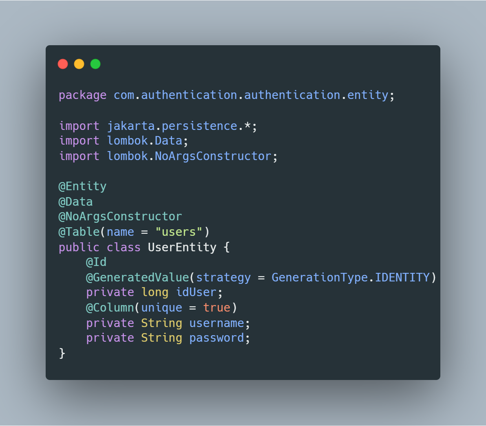
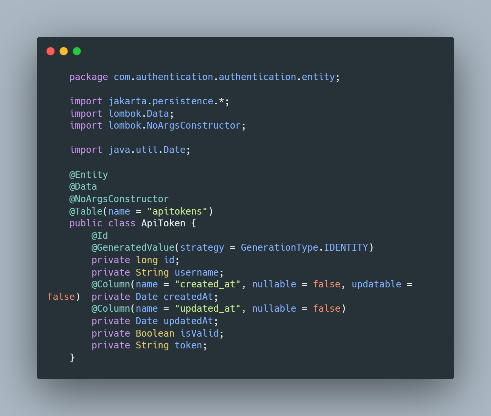
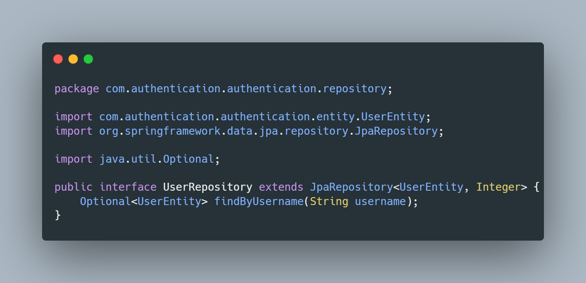
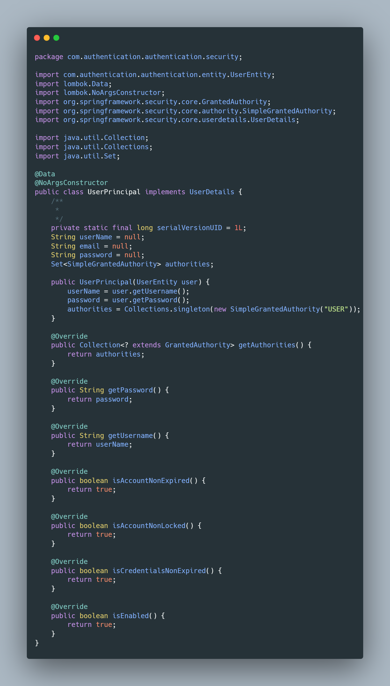
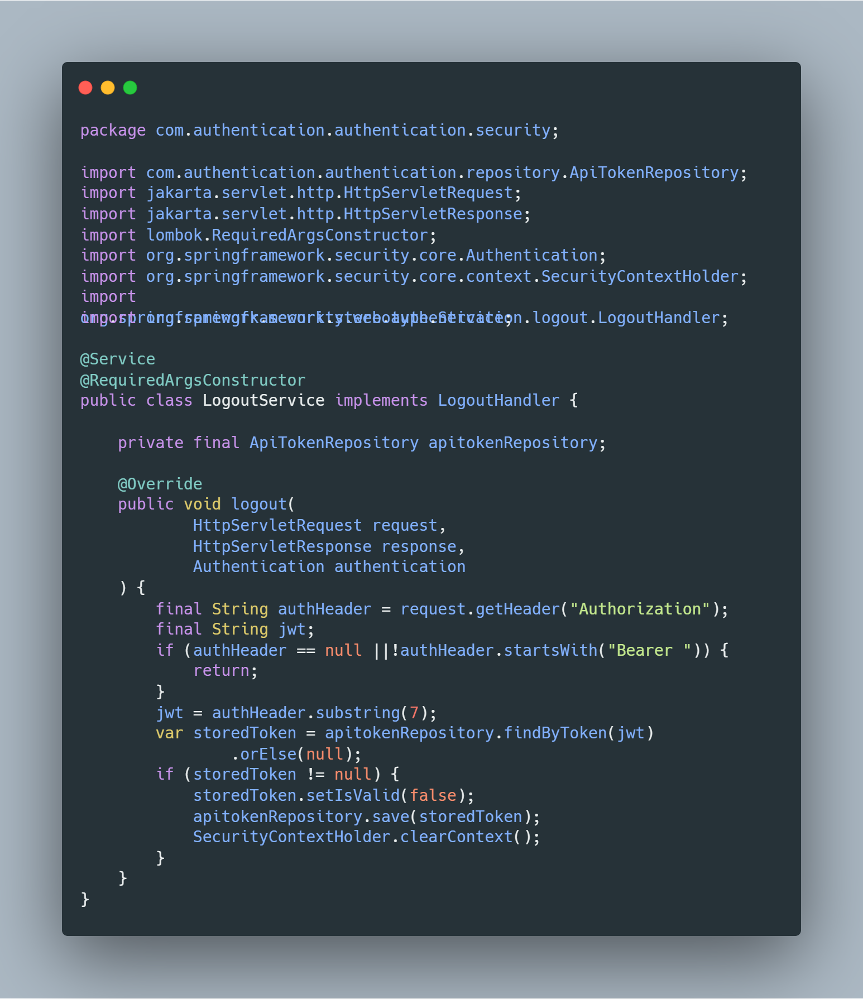
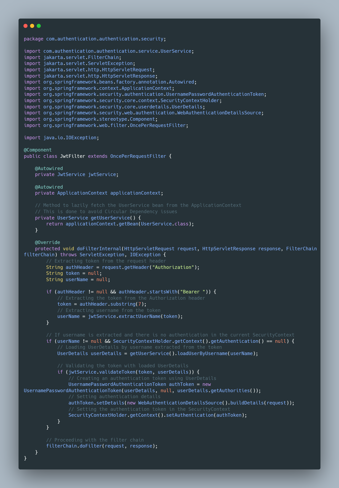
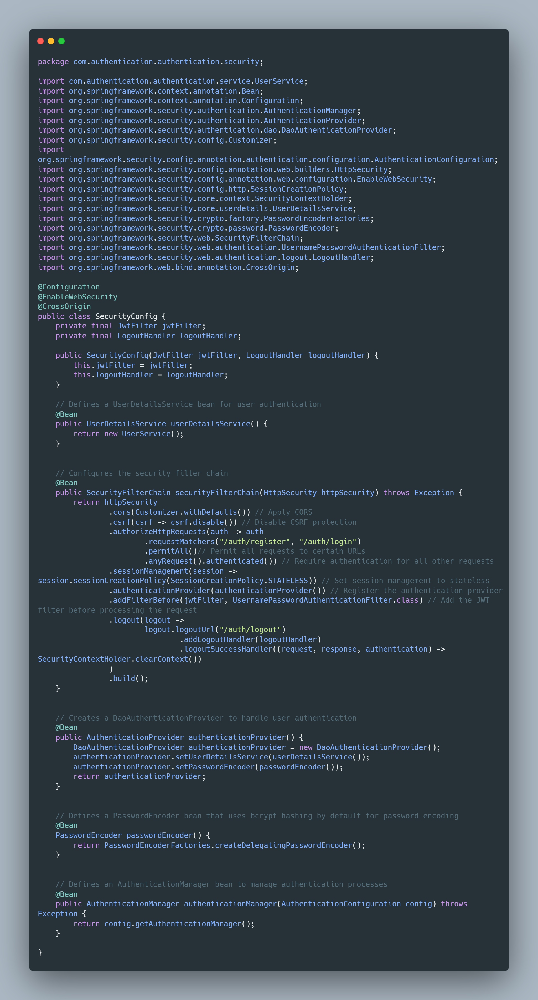
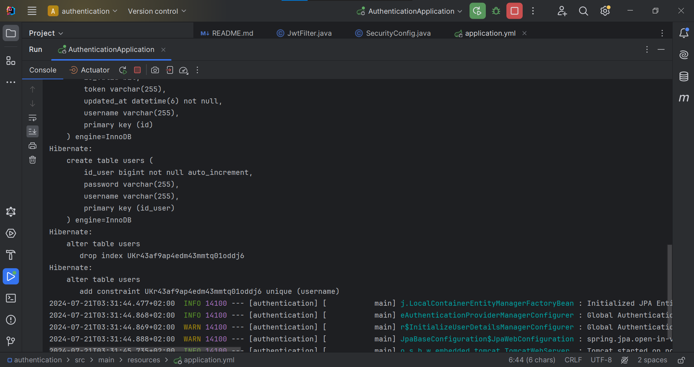
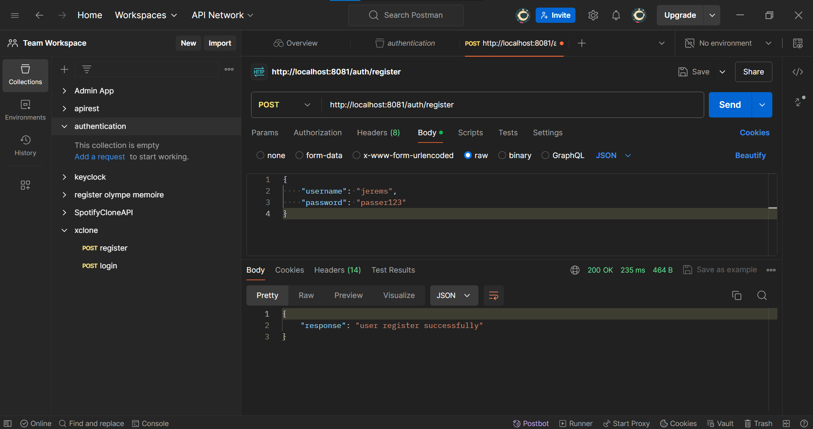
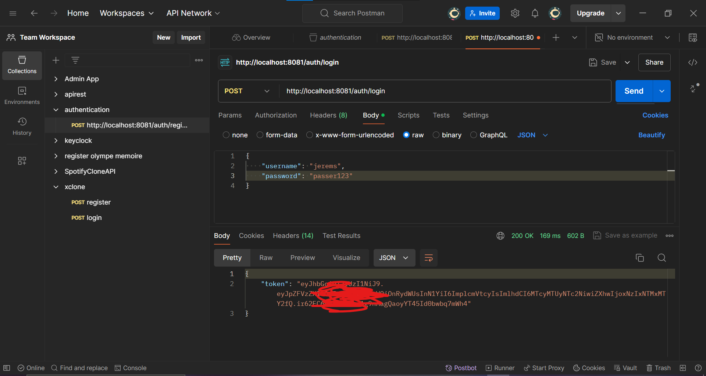

# JWT Authentication in Spring Boot
We can 
- Générate token
- Hash password
- validate Token
- Checks if the JWT token is expired.
- Extracts the expiration date from the JWT token.
- Extracts the valid from the JWT token.
- Extracts all claims from the JWT token
- Extracts the userName from the JWT token.
- Creates a signing key from the base64 encoded secret.

### Screenshot

### Built with
- Java - Spring Boot 
- jjwt

## Author

- LinkedIn - [Jérémy-Evrard OBIANG-ENGONE](https://www.linkedin.com/in/j%C3%A9r%C3%A9my-evrard-obiang-engone-257436247/)
- Twitter - [Check out Jerems✪🇬🇦 @jeremsOb ](https://x.com/jeremsOb?t=tuX8ctBHgo2b5buKLmVXXA&s=08)

